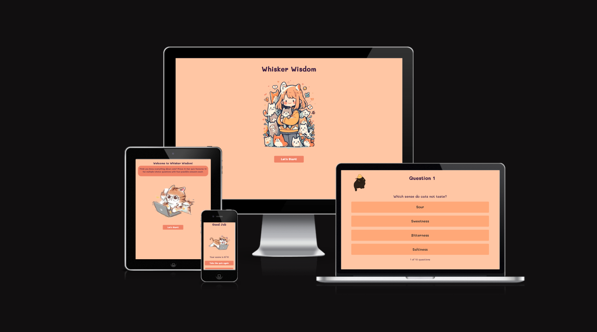
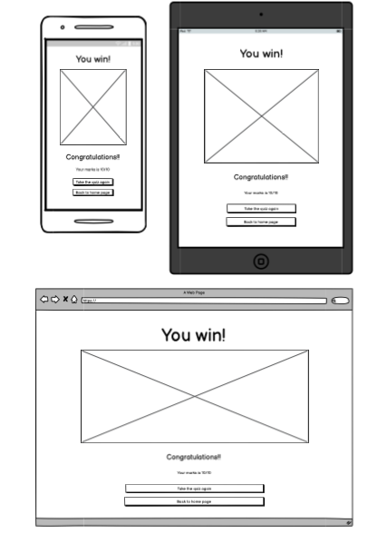

# [Whisker-wisdom](https://lauren21717.github.io/whisker-wisdom/)

[](https://github.com/Lauren21717/whisker-wisdom/commits/main)
[](https://github.com/Lauren21717/whisker-wisdom/commits/main)
[](https://github.com/Lauren21717/whisker-wisdom)


[Am I Responsive](https://ui.dev/amiresponsive?url=https://lauren21717.github.io/whisker-wisdom/)

**Whisker Wisdom:** Test Your *Knowlwdge*, Uncover Feline *Facts*!

An interactive and engaging quiz designed to challenge and grow your expertise on all things feline. Explore a variety of topics, from quirky cat behaviors to fascinating feline facts, and sharpen your knowledge about our whiskered companions. Perfect for cat lovers and curious minds alike!

## UX

Whisker Wisdom was developed with the aim of providing cat enthusiasts and curious minds a fun, interactive way to explore the fascinating world of felines. Understanding the diverse range of cat lovers, from seasoned pet owners to those simply intrigued by these captivating creatures, the application was designed to cater to all knowledge levels.

With a user-friendly interface, the app offers a seamless experience for all age groups, ensuring that the focus remains on learning and enjoyment. The interactive quizzes and engaging trivia provide a perfect balance between education and entertainment, allowing users to deepen their understanding of cat behaviors, fun facts, and more.

The design draws inspiration from simplicity and accessibility, ensuring that users can easily navigate through the content while discovering the wonderful world of cats in a visually appealing and intuitive environment.

### Colour Scheme

In designing Whisker Wisdom, I focused on creating a warm and inviting atmosphere, reflecting the playful and affectionate nature of our feline friends. After careful consideration, I selected a combination of orange and purple as the primary colors, as these tones evoke a sense of warmth, creativity, and comfort, enhancing the overall user experience.

Orange, associated with warmth and energy, was chosen to reflect the playful and lively spirit of cats, while purple conveys a sense of curiosity and mystery, perfectly aligning with the theme of uncovering fun and surprising feline facts. Together, these colors create a cozy and approachable feel, making users feel right at home as they explore the quizzes.

I used[coolors.co](https://coolors.co/) to generate my colour palette


The chosen colors not only enhance the aesthetic of the app but also guide the user experience. For example, green indicates correct answers, while red signals incorrect ones, providing instant feedback during the quiz.

I used[coolors.co](https://coolors.co/) to generate my colour palette


### Typography

For the typography in Whisker Wisdom, I selected the [Mali](https://fonts.google.com/specimen/Mali?query=Mali) font, a playful yet legible typeface that perfectly complements the warm and friendly atmosphere of the quiz. Sourced from Google Fonts, Mali’s rounded and slightly handwritten style offers a welcoming and approachable feel, making it an ideal choice for an application centered around fun and discovery.


## User Stories


### New Site Users

- As a new user, I want to test my knowledge about cats, so that I can see how much I know and learn new facts.
- As a new user, I want visual feedback when selecting answers, so that I can immediately know if I chose the correct or incorrect option.
- As a new user, I want instructions on how to play, so that I understand the quiz format and how to navigate the app.
- As a new user, I want to be able to navigate back to the home page, so that I can explore other options or retake the quiz easily.
- As a new user, I want the app to be visually appealing and user-friendly, so that I can enjoy the experience without confusion.

### Returning Site Users

- As a returning user, I want to retake the quiz, so that I can improve my score and enhance my cat knowledge.
- As a returning user, I want to see new facts and explanations after each question, so that I can keep learning regardless of my quiz performance.
- As a returning user, I want to see my score at the end of the quiz, so that I can assess my progress and challenge myself to do better.

### Game Administrator

- As an admin, I want to manage quiz questions, so that I can add, edit, or delete content to keep the quiz fresh and engaging for users.
- As an admin, I want to ensure the app remains intuitive and fun, so that users can continue to enjoy a seamless experience while learning.

## Wireframes

In line with best practices, wireframes were developed for mobile, tablet, and desktop sizes to ensure a consistent and optimized user experience across all devices. I used [Balsamiq](https://balsamiq.com/) to create the wireframes for all screen sizes and [Figma](https://www.figma.com/) to develop an interactive prototype specifically for the mobile version of the site.

### Landing Page Wireframe

<details>
<summary> Click here to see the Landing Page Wireframe </summary>


</details>

### Intro Page Wireframe

<details>
<summary> Click here to see the Intro Page Wireframe </summary>


</details>

### Quiz Page Wireframe

<details>
<summary> Click here to see the Quiz Page Wireframe </summary>


</details>

### Pass Page Wireframe

<details>
<summary> Click here to see the Pass Page Wireframe </summary>




</details>

### Fail Page Wireframe

<details>
<summary> Click here to see the Fail Page Wireframe </summary>


</details>

## Cat Knowledge Quiz Data

> [!TIP]  
> SPOILERS!  
> Answer sheet below.

<details>
<summary> Cat Questions </summary>

| Question                                                                                                 | Options                                                      | Answer |
|----------------------------------------------------------------------------------------------------------|--------------------------------------------------------------|--------|
| Which sense do cats not taste?                                                                           | 1. Sour <br> 2. Sweetness <br> 3. Bitterness <br> 4. Saltiness | 2      |
| What does it mean when a cat sticks its butt in your face?                                              | 1. They are angry <br> 2. They want food <br> 3. It's a gesture of friendship <br> 4. They want to play | 3      |
| Cats are nearsighted, but their night vision is:                                                        | 1. Worse than humans <br> 2. Nonexistent <br> 3. The same as humans <br> 4. Better than humans | 4      |
| Which bone in a cat's body is unique compared to humans?                                               | 1. Collarbone <br> 2. Femur <br> 3. Spine <br> 4. Skull | 1      |
| When a cat flops over and exposes his belly, it means:                                                  | 1. He wants a belly rub <br> 2. He is scared <br> 3. He is angry <br> 4. He is relaxed and showing trust | 4      |
| If your cat approaches you with a straight, almost vibrating tail, it means:                             | 1. She is scared <br> 2. She is annoyed <br> 3. She is extremely happy to see you <br> 4. She wants to play | 3      |
| A cat with a question-mark-shaped tail is:                                                               | 1. Asking, "Want to play?" <br> 2. Feeling scared <br> 3. Annoyed <br> 4. Hungry | 1      |
| How many different vocalizations can cats have?                                                         | 1. Up to 10 <br> 2. Up to 50 <br> 3. Up to 100 <br> 4. Up to 200 | 3      |
| Who do cats develop meowing behavior for?                                                                | 1. Other cats <br> 2. Birds <br> 3. Dogs <br> 4. People | 4      |
| Which paw do male cats predominantly use?                                                                | 1. Right paw <br> 2. Left paw <br> 3. Both paws equally <br> 4. None of the above | 2      |

</details>


## Features

### Existing Features

- **Landing Page**

    - The main heading of the landing page prominently displays the text "Whisker Wisdom," clearly indicating that the quiz is focused on cat knowledge. 

      

- **Engaging Picture**

    - The landing page features an attractive picture related to cats, capturing user attention and providing an appealing introduction to the quiz.

      

- **"Let's Start" Button**

    - A prominently displayed "Let's Start" button navigates users to the introduction page (Intro), acting as a call to action and encouraging users to begin their quiz journey.

      

- **Intro Page Greeting**

    - The Intro page features a welcoming greeting at the top: "Welcome to Whisker Wisdom!" This sets a friendly tone for the quiz.

      

- **Introducing Text**

    - An introductory text reads, "Think you know everything about cats? Prove it! Our quiz features 10 fun multiple-choice questions with four possible answers each." This explains the purpose of the quiz and encourages users to test their knowledge.

      

- **Engaging Picture**

    - The Intro page displays another attractive picture related to cats, enhancing the page's appeal and engagement.

      

- **"Let's Start" Button**

    - A "Let's Start" button on the Intro page navigates users to the quiz page, allowing them to begin their quiz journey.

      

- **Quiz Page Question Heading**

    - The Quiz page features a dynamic heading displaying the current question number, such as "Question 1," "Question 2," etc.

      

- **Question Display Heading**

    - A heading displays the actual question that the user needs to answer.

      

- **Multiple-Choice Answers**

    - Four multiple-choice answers are presented for each question, allowing users to choose the correct one.

      

- **Highlight Correct Answer (Green)**

    - If the user's answer is correct, it will be highlighted in green, providing visual feedback on their choice.

      

- **Highlight Incorrect Answer (Red) and Display Correct Answer (Green)**

    - If the user's answer is incorrect, their chosen answer will be highlighted in red, and the correct answer will be highlighted in green.

      

- **"Next Question" Button**

    - A button labeled "Next Question" allows users to proceed to the next question after answering the current one.

      

- **Question Progress Display**

    - A display shows the current question number out of the total number of questions, keeping users informed about their progress in the quiz.

      

- **Pass Page Heading**

    - The Pass page features a heading displaying "Good Job!" to congratulate the user for passing the quiz.

      

- **Pass Picture**

    - A picture displayed on the Pass page enhances its visual appeal.

      

- **Show Quiz Score**

    - The Pass page displays the user's quiz score out of the total possible score.

      

- **Fail Page Heading**

    - The Fail page features a heading displaying "Fur-get About It!" humorously informing the user of their quiz failure.

      

- **Fail Picture**

    - A picture displayed on the Fail page enhances its visual appeal.

      

- **Show Quiz Score**

    - The Fail page displays the user's quiz score out of the total possible score.

      

- **"Back to Home Page" Button**

    - A button labeled "Back to Home Page" allows users to navigate back to the home page.

      

- **"Take the Quiz Again" Button**

    - A button labeled "Take the Quiz Again" enables users to start the quiz again from the beginning.

      


### Future Features

- Leaderboard

  - Implement a leaderboard to display the top scores of users. This feature encourages competition and engagement, allowing users to compare their performance with friends or other players.

- Timed Quiz Option

  - Introduce a timed quiz mode where users must answer questions within a set time limit. This adds an element of challenge and excitement, enhancing the gameplay experience.

- Randomized Questions

  - Allow users to take quizzes with randomized questions from a larger question pool. This feature ensures that users have a different experience each time they play, increasing replayability.

- Feedback System

  - Incorporate a feedback system where users can report issues or suggest improvements for the quiz. This feature can help you continually enhance the user experience based on player input.

## Development Story

This section outlines the development process of the Quiz Application. The objective is to create an engaging platform where users can answer a series of questions, receive feedback on their performance, and navigate seamlessly between different sections of the app. The development story is organized into distinct features that were implemented to achieve this functionality.

- **Setting Up Navigation Between Pages**

  **Objective**: Enable users to navigate smoothly between the index, intro, quiz, and result pages.

  To facilitate user navigation, I implemented functions that redirect users to different sections of the application. These functions are triggered by button clicks, providing an intuitive user experience.

  ```js
  // Function to navigate from index to intro page
  function navigateToIntro() {
      window.location.href = 'intro.html';
  }

  // Function to navigate from intro to quiz page
  function navigateToQuiz() {
      window.location.href = 'quiz.html';
  }

  // Function to navigate back to the index page
  function navigateToHome() {
      window.location.href = 'index.html';
  }
  ```

- **Initializing and Managing the Quiz Flow**

  **Objective**: Manage the quiz state, including current question number, score tracking, and transitioning between questions.

  I developed a comprehensive quiz management system that initializes the quiz, displays questions, handles user selections, updates scores, and navigates to the result page upon completion.

  ```js
  // Function to initialise the quiz
  function startQuiz() {
      currentQuestionNo = 0;
      score = 0;
      showQuestion();
      updateProgressText();
  }

  // Function to show the current question
  function showQuestion() {
      resetState();
      let currentQuestion = quizData[currentQuestionNo];
      questionIndex.innerHTML = currentQuestionNo + 1;
      questionText.innerHTML = currentQuestion.question;

      currentQuestion.answers.forEach(answer => {
          const li = document.createElement("li");
          li.innerHTML = answer.text;
          li.classList.add("list-group-item", "custom-list-item", "mb-4", "rounded", "py-4");
          answerList.appendChild(li);
          if (answer.correct) {
              li.dataset.correct = answer.correct;
          }
          li.addEventListener("click", selectAnswer)
      });
  }

  // Function to reset the state between questions
  function resetState() {
      nextButton.style.setProperty('display', 'none', 'important');
      while (answerList.firstChild) {
          answerList.removeChild(answerList.firstChild);
      }
  }
  ```

- **Handling Answer Selection and Scoring**

  **Objective**: Allow users to select answers, provide immediate feedback, and accurately track their scores.

  I implemented an interactive answer selection mechanism that visually indicates correct and incorrect choices, disables further selections after an answer is chosen, and updates the user's score accordingly.

  ```js
  // Function to handle answer selection
  function selectAnswer(e) {
      const selectedOption = e.target;
      const isCorrect = selectedOption.dataset.correct === "true";
      if (isCorrect) {
          selectedOption.classList.add("bg-success");
          score++;
      } else {
          selectedOption.classList.add("bg-danger");
      }
      Array.from(answerList.children).forEach(option => {
          if (option.dataset.correct === "true") {
              option.classList.add("bg-success");
          }
          option.classList.add("disabled-option");
      });
      nextButton.style.setProperty('display', 'block', 'important');
  }
  ```

- **Displaying Progress and Navigating Through Questions**

  **Objective**: Provide users with real-time feedback on their progress through the quiz and enable them to proceed to the next question or view results upon completion.

  I integrated a progress indicator that updates as users answer questions and implemented a `nextQuestion` function to handle the transition between questions or to the result page.

  ```js
  // Function to handle answer selection
  // Function to show next question or end the quiz
  function nextQuestion() {
      currentQuestionNo++;
      if (currentQuestionNo < quizData.length) {
          showQuestion();
          updateProgressText();
      } else {
          showResult();
      }
  }

  // Function to update the progress text
  function updateProgressText() {
      if (progressText) {
          progressText.innerHTML = `${currentQuestionNo + 1} of ${totalQuestions} questions`
      }
  }

  // Add event listener to the next button (for the quiz page)
  if (nextButton) {
      nextButton.addEventListener("click", () => {
          if (currentQuestionNo < quizData.length - 1) { 
              nextQuestion();
          } else {
              showResult(); 
          }
      });
  }
  ```

- **Result Calculation and Display**

  **Objective**: Calculate the user's final score and display personalized feedback based on their performance.

  I created a result display system that retrieves the user's score from `localStorage`, determines pass or fail status, and presents corresponding messages and images.

  ```js
  // Function to show the result (pass or fail)
  function showResult() {
      localStorage.setItem('quizScore', score);
      window.location.href = 'result.html';
  }

  // Function to display the result on the result page
  function displayResult() {
      let score = localStorage.getItem('quizScore') || 0;

      if (score >= 5) {
          resultTitle.innerHTML = "Good Job";
          resultImage.src = "assets/images/pass.png";
      } else {
          resultTitle.innerHTML = "Fur-get About It!";
          resultImage.src = "assets/images/fail.png";
      }

      resultScore.innerHTML = `Your score is ${score}/${totalQuestions}`;
  }

  // Check if we are on the result page
  if (resultTitle && resultImage && resultScore) {
      displayResult();
      if (retryButton) {
          retryButton.addEventListener('click', navigateToQuiz);
      }
      if (homeButton) {
          homeButton.addEventListener('click', navigateToHome)
      }
  }
  ```


## Tools and Technologies Used

- [](https://balsamiq.com/wireframes) - Used for creating wireframes.
- [](https://www.figma.com/) - Used for creating wireframes and designing UI.
- [](https://git-scm.com) - Version control system to track code changes.
- [](https://github.com) - Secure platform for online code storage and collaboration.
- [](https://pages.github.com) - Used for hosting the deployed front-end site.
- [](https://gitpod.io) - Cloud-based IDE for streamlined development.
- [](https://en.wikipedia.org/wiki/HTML) - Markup language for structuring web content.
- [](https://en.wikipedia.org/wiki/CSS) - Stylesheet language used for the site’s design and layout.
- [](https://getbootstrap.com) - Front-end framework for responsive design and pre-built components.
- [](https://www.javascript.com) - Programming language for implementing interactivity and user interaction on the site.
- [](https://jquery.com) - JavaScript library used to simplify DOM manipulation and event handling.
- [](https://jestjs.io/) - Testing framework for ensuring reliable JavaScript code.
- [](https://fonts.google.com) - Source for web fonts used to enhance typography.
- [](https://chat.openai.com) - AI tool used to assist in content creation.
- [](https://www.pinterest.co.uk/) - Platform used for design inspiration and image sourcing.
- [](https://ezgif.com) - Used to convert screen recordings to GIF format.


## Testing

> [!NOTE]  
> For all testing, please refer to the [TESTING.md](TESTING.md) file.


## Deployment

The site was deployed to GitHub Pages. The steps to deploy are as follows:

- In the [GitHub repository](https://github.com/Lauren21717/whisker-wisdom
), navigate to the Settings tab 
- From the source section drop-down menu, select the **Main** Branch, then click "Save".
- The page will be automatically refreshed with a detailed ribbon display to indicate the successful deployment.

The live link can be found [here](https://lauren21717.github.io/whisker-wisdom/)

### Local Deployment

This project can be cloned or forked in order to make a local copy on your own system.

#### Cloning

1. Go to the GitHub repository.
2. Click on the "Code" button and copy the URL.
3. Open your terminal and run:
   ```bash
   git clone https://github.com/Lauren21717/whisker-wisdom

#### Forking

By forking a GitHub repository, you create a personal copy of the original repository under your own GitHub account. This allows you to view and modify the code without affecting the original repository.

To fork this repository, follow these steps:

1. Log in to GitHub and navigate to the [GitHub Repository](https://github.com/Lauren21717/whisker-wisdom).
2. At the top-right corner of the repository page, just above the "Settings" button, click the "Fork" button.
3. After clicking the "Fork" button, a copy of the repository will be created under your GitHub account.

You can now work on your own copy of the repository, make changes, and propose improvements through pull requests if desired.

## Credits

- [Pinterest](https://www.pinterest.co.uk/) - Images for the hero section.
- [ChatGPT](https://chatgpt.com/) - Content assistance.
- [Jest](https://jestjs.io/) - A delightful JavaScript testing framework.
- [Babel](https://babeljs.io/) - A JavaScript compiler to convert modern JavaScript into backwards-compatible code.

## Acknowledgements

I would like to express my gratitude to the following:

- The **Code Institute Slack community** for their moral support; it kept me going during periods of self-doubt and imposter syndrome.
- My friends for generously dedicating their time to test the game and provide valuable feedback.