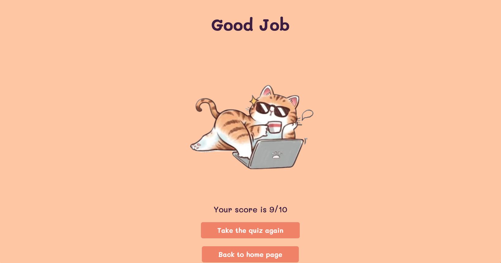
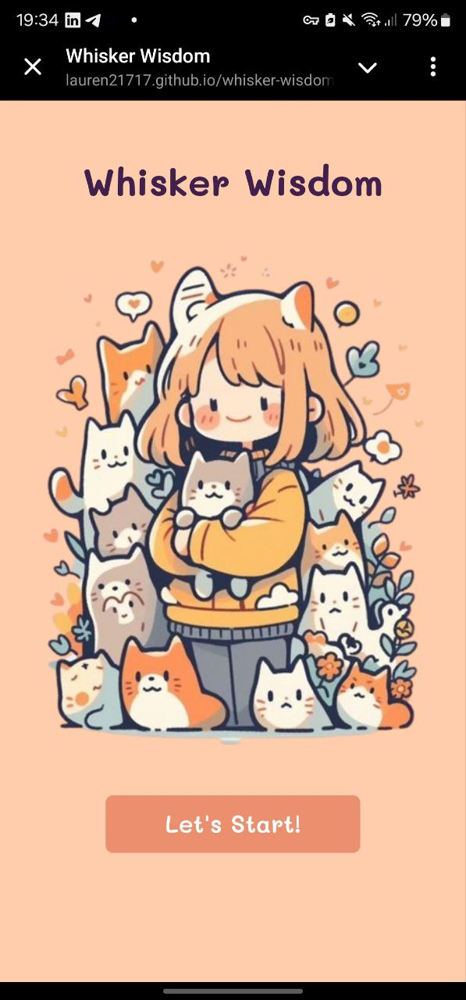
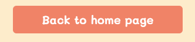

# Testing

> [!NOTE]  
> Return back to the [README.md](README.md) file.

## Code Validation
### HTML
I have used the recommended [HTML W3C Validator](https://validator.w3.org) to validate all of my HTML files.

| Validator| File | Screenshot | Notes |
| --- | --- | --- | --- |
|[W3C Validator](https://validator.w3.org/nu/?doc=https%3A%2F%2Flauren21717.github.io%2Fwhisker-wisdom%2F)| index.html |  | No errors found|
|[W3C Validator](https://validator.w3.org/nu/?doc=https%3A%2F%2Flauren21717.github.io%2Fwhisker-wisdom%2Fintro.html)| intro.html |  | No errors found|
|[W3C Validator](https://validator.w3.org/nu/?doc=https%3A%2F%2Flauren21717.github.io%2Fwhisker-wisdom%2Fquiz.html)| quiz.html |  | No errors found|
|[W3C Validator](https://validator.w3.org/nu/?doc=https%3A%2F%2Flauren21717.github.io%2Fwhisker-wisdom%2Fresult.html)| result.html |  | No errors found|

### CSS

I have used the recommended [CSS Jigsaw Validator](https://jigsaw.w3.org/css-validator) to validate all of my CSS files.

| Directory | File | Screenshot | Notes |
| --- | --- | --- | --- |
| assets | style.css |  | No error on style.css file |

### JavaScript

I have used the recommended [JShint Validator](https://jshint.com) to validate all of my JS files.

| Directory | File | Screenshot | Notes |
| --- | --- | --- | --- |
| assets | quiz.js |  | ES6 syntax validated, no critical errors found |
| assets | data.js |  | ES6 syntax validated, no critical errors found |
| assets | quiz.test.js |  | Undefined variables from jest |

## Browser Compatibility

I've tested my deployed project on multiple browsers to check for compatibility issues.

| Browser | Start Modal | Quiz Page | Intro Page | Result Page | Notes |
| --- | --- | --- | --- | --- | --- |
| Chrome |  |  |  |  | Works as expected |
| Firefox |  |  |  |  | Works as expected |
| Safari |   |  |  |  | Works as expected |

## Responsiveness

I've tested my deployed project on multiple devices to check for responsiveness issues.

| Browser | Start Modal | Intro Page | Quiz Page | Result Page | Notes |
| --- | --- | --- | --- | --- | --- |
| Mobile (DevTools) (320px) |  |  |  |  | Works as expected |
| Tablet (DevTools) (768px) |  |  |  |  | Works as expected |
| Desktop | |  |  |  | Works as expected |
| Personal Mobile (Samsung S22 Ultra) |  |  |  |  | Works as expected |

## Lighthouse Audit

I've tested my deployed project using the Lighthouse Audit tool to check for any major issues.

| Page | Mobile | Desktop | Notes |
| --- | --- | --- | --- |
| index.html |  |  |  No issues |
| intro.html |  |  |  No issues |
| quiz.html |  |  |  No issues |
| result.html |  |  |  No issues |

## Defensive Programming

Defensive programming was manually tested with the below user acceptance testing:

| Feature | Expectation | Test | Result | Fix | Screenshot |
| --- | --- | --- | --- | --- | --- |
| Start Quiz Button | When the "Start" button is clicked, the quiz should begin, and the intro screen disappears | Tested by clicking the "Start" button | The feature behaved as expected | Test concluded and passed |  |
| Answer List | User should only be able to select one answer from the list  | Tested by selecting multiple answers | The feature behaved as expected | Test concluded and passed |  |
| Next Question Button | "Next Question" button should only be enabled after selecting an answer | Tested by attempting to click "Next" without selecting an answer first | The feature behaved as expected | Test concluded and passed |  |
| Quiz Progress Display | Quiz progress should display correctly based on the current question | Tested by navigating through the quiz and observing progress updates | The feature behaved as expected | Test concluded and passed |  |
| Final Score Calculation | After completing the quiz, the final score should be displayed | Tested by finishing the quiz and checking the result score | The feature behaved as expected | Test concluded and passed |  |
| Retry Quiz Button | "Take the quiz" button should restart the quiz, clearing previous progress | Tested by clicking the "Take the quiz" button after completing the quiz | The feature behaved as expected | Test concluded and passed |  |
| Home Button | "back to home page" button should return the user to the intro page | Tested by clicking the "back to home page" button after completing the quiz | The feature behaved as expected | Test concluded and passed |  |

## User Story Testing

| User Story | Screenshot |
| --- | --- |
| As a new quiz user, I would like to see a clear and memorable title on the landing page, so that I can identify the quiz. |  |
| As a new quiz user, I would like to see an engaging image related to cats on the landing page, so that I feel interested in starting the quiz. |  |
| As a new quiz user, I would like to see a "Let's Start" button on the landing page, so that I can easily begin the quiz journey. |  |
| As a new quiz user, I would like to see clear instructions on the Intro page, so that I know what to expect from the quiz. |  |
| As a returning quiz user, I would like to see a "Next Question" button, so that I can easily move on to the next question after answering. |  |
| As a returning quiz user, I would like to see my progress displayed (e.g., Question 2 of 10), so that I can keep track of my progress during the quiz. |  |
| As a quiz user, I would like to see my correct answers highlighted in green, so that I know when I’ve chosen the right answer. |  |
| As a quiz user, I would like to see my incorrect answers highlighted in red with the correct answer displayed in green, so that I can learn from my mistakes. |  |
| As a quiz user, I would like to see a summary of my score at the end of the quiz on the Pass Page, so that I know how well I did. |  |
| As a quiz user, I would like to see a humorous message and score summary on the Fail Page, so that I can understand my result and feel motivated to try again. |  |
| As a quiz user, I would like the option to start the quiz again after I finish, so that I can try to improve my score. |  |
| As a quiz user, I would like the option to return to the home page after completing the quiz, so that I can easily navigate back. |  |

## Automated Testing
Although automated testing is valuable for maintaining code quality, implementing it for the quiz functionality in this project would be overly complex. The quiz relies heavily on DOM manipulation and Bootstrap, making accurate simulation in a test environment challenging.

Given the project's scope and time constraints, we opted for thorough manual testing to ensure the quiz operates correctly.

In larger or more complex projects, investing in a robust automated testing setup may be justified. For future iterations or similar projects, automated tests could enhance long-term maintainability and help catch regressions early in development.

## User Feedback

The web application was tested by a few individuals, and the overall feedback was positive. Users described the game as "fun and interactive," which indicates that the gameplay successfully engages users and provides an enjoyable experience. One user specifically noted that the design was "pretty and nice," highlighting the appeal of the visual elements and interface.

### Key Positive Feedback:
 - **Engaging Gameplay:** Users found the game mechanics entertaining and easy to understand, which contributed to the interactive experience.

 - **Aesthetics:** The design and visual elements of the game were well-received, adding to the overall enjoyment.

 - **Usability:** Users appreciated the smooth navigation and clear layout of the game, making it easy to play.

### Potential Areas for Improvement:
 - **Variety of Questions:** Users suggested adding more variety in the questions, or shuffling the answers, to enhance the replayability and challenge.

 - **Additional Features:** Some users expressed interest in extra functionalities, such as a Leaderboard to track high scores and a Timed Quiz Option for an added layer of difficulty and excitement.

These suggestions will be considered for future updates to further enhance the user experience.

## Bugs

No bugs were encountered during testing. The game functioned as intended, providing a smooth and error-free user experience.

## Unfixed Bugs

There are no known unfixed bugs at this time. All identified issues during the development and testing phases were resolved.